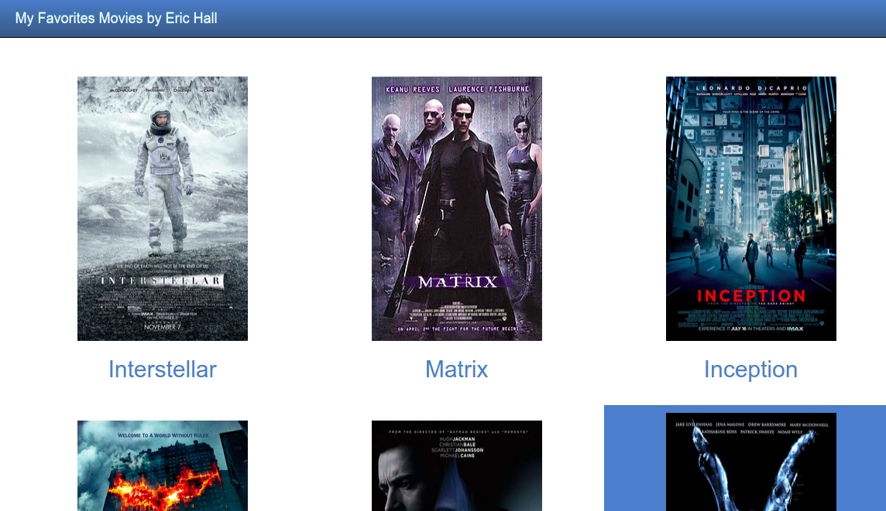

# My Favorites Movies

This repository is about the first project from Udacity Full Stack Development nanodegree. This implements a class called Movie, that build an object necessary to using the fresh_tomatoes.py. This program creates dynamically a web page using a list of Movies as input.




## Features

- A tooltip was insert to demostrate the storyline movie.

## Getting Started

These instructions will get you a copy of the project up and running on your local machine for development and testing purposes. See deployment for notes on how to deploy the project on a live system.

### Prerequisites

```
1- Python 2.7.1

2- A good browser

3- A terminal
```
## Steps

* All you have to do it is to run the python program with this command below on terminal:

```
$ python entertainment_center.py
```
This will create a file called "fresh_tomatoes.html" that you can open using
your prefered browser. You can also click on movie to see the trailer. 

The html should demonstrate the result of my favorites movies in HTML as show above.

## How to Contribute

If would like to contribuite with this code, please fork this repository using the command below.

```sh
$ git clone https://github.com/ericmbf/project1FullStackDevelopment.git
```

## License

The contents of this repository are covered under the [MIT License](LICENSE).
